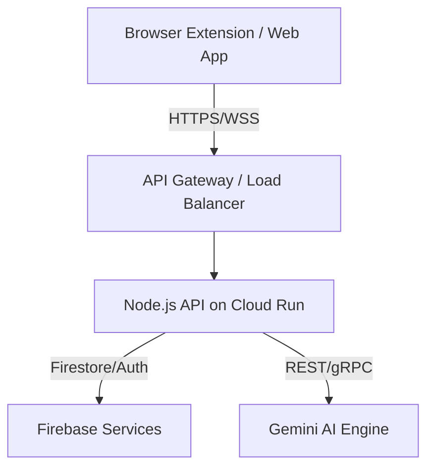

# System Architecture Overview

## Mục tiêu
Tài liệu này cung cấp cái nhìn tổng quan về kiến trúc hệ thống của Internet Immune System, bao gồm các thành phần chính, luồng dữ liệu và tương tác giữa chúng. Đảm bảo một kiến trúc mở rộng, hiệu suất cao và bảo mật.

## Nội dung chính

### Kiến trúc tổng thể

Hệ thống được thiết kế theo kiến trúc Microservices / Serverless kết hợp, tận dụng tối đa hệ sinh thái Google Cloud Platform.

### Luồng dữ liệu (Data Flow)
1. **Thu thập dữ liệu**: Browser extension thu thập URL, HTML content, meta tags từ trang web người dùng đang truy cập.
2. **Gửi request**: Gửi payload đến API endpoint được host trên Google Cloud Run.
3. **Xử lý AI**: Node.js API gọi đến Gemini API (qua Vertex AI) để phân tích lừa đảo (Detect), giải thích (Explain), và mô phỏng hậu quả (Simulate).
4. **Lưu trữ & Phản hồi**: Kết quả phân tích được lưu vào Firebase Firestore và trả về cho Client để hiển thị theo thời gian thực (Real-time protection).

## Checklist
- [x] Định nghĩa kiến trúc high-level
- [x] Xác định các thành phần cốt lõi
- [x] Vẽ luồng dữ liệu cơ bản
- [ ] Review kiến trúc với đội ngũ bảo mật

## Tài liệu liên quan
- [Component Diagram](ComponentDiagram.md)
- [Tech Stack](TechStack.md)

## Việc cần làm tiếp
- Triển khai PoC (Proof of Concept) cho luồng dữ liệu chính từ Extension -> API -> Gemini.
